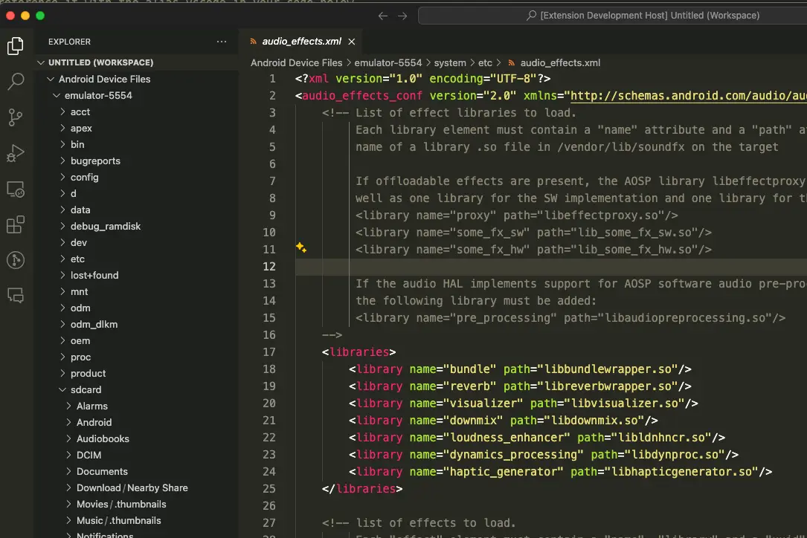

# ADB File System

It allows to use file system on your ADB-connected device (via `adbkit`). Currently supported:

* browse devices
* browse directories
* read/write files
* rename file/directory
* move file/directory
* create file/directory
* delete file/directory

## Getting Started

* install this extension `ADB File System`.
* press F1 key in VSCode and select `Setup Android Device Files Workspace`.
  * if the command does not appear, try with new window by CTRL+SHIFT+N.

## Requirements

* adb (android debug bridge) must be installed on your PC. It resides on the android SDK (platform-tools).
* adb server needs to be started beforehand. command: `adb start-server`
* You need at least one android device(s) connected to your PC.
  * usually via USB cable.
  * over wifi is also possible but need to follow some adb instructions (please see documents of adb).
* target devices must have developer mode turned on, and also USB debugging enabled.
